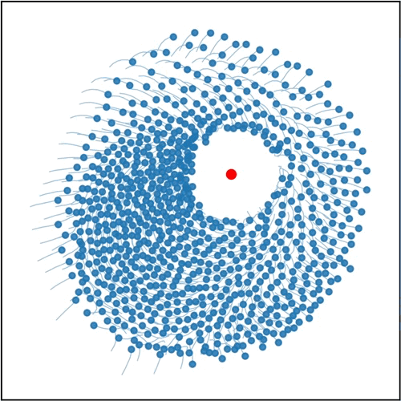

<p align="center">
  
</p>

This python pacakge was created for the final project of my bachelors degree, and  is a recreation of [Lymburn et al 2021](https://research-repository.uwa.edu.au/en/publications/reservoir-computing-with-swarms/). The paper introduced a reservoir computing framework introduced, which uses a Reynolds boids inspired swarm as the reservoir, for a Lorenz System prediction task.\

## Feature Overview
- Boid swarm and Lorenz simulation generation.
- Generating simulations.
- Saving simulations, simulation readouts, trained ridge regression outputs, consistency profiles.
- Viewing simulations as animations.
- Plotting frames of a simulation.
- Plotting ridge regression outputs.
- Usage of parameters files for use in generating simulations.
- Multiple methods for creating linear readouts on simulations.
- Multiple methods for calculating the consistency profile of a readout.
- Ridge regression pipeline for evaluating readouts.

## Package Structure
* **`src/Simulators`**: The core physics engine handling boid movements and force calculations as well as the generation of the Lorenz System.
* **`src/Visualisers`**: Matplotlib-based functions for viewing data outputed from other parts of the package.
* **`src/ConfigManager`**: Used for creating and loading `.ini` files which define simulation parameters.
* **`src/SaverLoader`**: Handles the saving and loading of data to `.npz` files, conditionally, using `np.memmap` and temporary `.npy` files.
* **`src/ObservationAnalysis`**: Defines a base class for performing linear readouts on swarm data, in addition to methods for ridge regression and calculating the consistent capacity. Defines subclasses for Kernel Readouts, COM readouts, Naive Readouts, Flat Readouts
* **`examples.ipynb`**: Python notebook which explains in detail how to use the package outside of CLI.
* **`tests/`**: Included directory for managing test cases, contains a README file explaining recommended methods.

---
# Requirements
**Python Version:**\
`3.12.12` or higher 

**Dependencies:**
```bash
pip install -r requirements.txt
```
# Package usage
Usage of the package in conjunction with detailed explainations are within `examples.ipynb`.


# Using the CLI
`python -m src -h` produces the help menu

```
usage: __main__.py [-h] [--run [RUN]] [--save [SAVE]] [--view [VIEW]] [--iterations [ITERATIONS]] [--chunk [CHUNK]] [--no-seed [NO_SEED]] [--generate-config [GENERATE_CONFIG]]

options:
  -h, --help            show this help message and exit
  --run [RUN], -r [RUN]
                        Path to a .ini config file containing simulation parameters.
  --save [SAVE], -s [SAVE]
                        Path to directory where simulations are saved on completion.
  --view [VIEW], -v [VIEW]
                        Path to an .npz containing simulation data. Animates the simulation.
  --iterations [ITERATIONS], -i [ITERATIONS]
                        Number of times the simulation is run. Default is 1.
  --chunk [CHUNK], -c [CHUNK]
                        Int value for chunk size used; enables use of numpy memory mapping.
  --no-seed [NO_SEED]   Overide config seed with a random value.
  --generate-config [GENERATE_CONFIG], -g [GENERATE_CONFIG]
                        Path to directory where a template .ini will be generated.

```


#### Initialising Test Cases / Generating Parameters
Running a simulation requires a set of compatible parameters stored in a `.ini` file. A template config can be generated using:
```bash
python -m src --generate-params ./
```
Which creates the config.ini file in the path specified.\
`.ini` config files may be given any name, but must use the `.ini` extension.\

The recommended use case is to create different `.ini` config files for different test cases. The recommended method for managing is explained in the README found within `tests/`.

##### Config Parameters
| Parameter | Description |
| :--- | :--- |
| **Simulation Parameters** | |
| `delta_t` | Time interval between simulation step time interval. |
| `simulation_steps` | Total number of simulation steps. |
| `boid_count` | Number of boids simulated. |
| `spawn_min` | Minimum spawn boid spawn position ($x^+, y^+$). |
| `spawn_max` | Maximum spawn boid spawn position ($x^-, y^-$). |
| `random_velocity` | Whether to override the seed, and initialise the boids with random velocities. |
| `random_position` | Whether to override the seed, and initialise the boids with random positions. |
| `random_seed` | Random seed used for generating the positions and velocities (given no overrides). |
| `predator` | Whether or not to calculate the total force of each boid with a predator force. I.e. option to disable the predator. |
| **Force Parameters** | |
| `k_speed` | Speed value used for friction force calculation. |
| `k_repulsion` | Repulsion Force coefficient. |
| `k_alignment` | Alignment Force coefficient. |
| `k_homing` | Homing Force coefficient. |
| `k_friction` | Friction Force coefficient. |
| `k_predator` | Predator Force coefficient. |
| `alpha` | Force Sigmoid parameter. |
| `beta` | Force Sigmoid parameter. |
| **Neighbourhood Radii** | |
| `rad_repulsion` | Radius for determining repulsion neighbourhood. |
| `rad_alignment` | Radius for determining alignment neighbourhood. |
| `rad_predator` | Radius for determining the boids affected by the predator force. |
| **Lorenz System Parameters** | |
| `l_sigma` | Parameter used in ODEs. |
| `l_rho` | Parameter used in ODEs. |
| `l_beta` | Parameter used in ODEs. |
| `x_lorenz` | Starting x position. |
| `y_lorenz` | Starting y position. |
| `z_lorenz` | Starting z position. |
| `l_sampling_rate` | Rate at which the Lorenz is sampled by the predator. |


#### Running Simulations
*a .ini as described in the previous section is required for running a simulation!*

##### Dry Run
The following command runs a simulation given a `.ini` config file:
```bash
python -m src --run PATH_TO_INI/config.ini
```
A dry run can be used to validate that your `.ini` contains the neccesary parameters, as well as that your installation is correct.


##### Saving
The `--save` parameter specifies directory where a simulation will be saved. The simulation is saved as an `.npz` file.
```bash
python -m src --run PATH_TO_INI/config.ini --save SAVE_PATH/TEST_CASE/runs/
```
The README within `tests/` explains a recommended method for managing test cases.

##### Multiple Runs
Multiple simulations can be simulated (and saved) from one command through using the following:
```bash
python -m src --run PATH_TO_INI/config.ini --save SAVE_PATH/TEST_CASE/runs/ --iterations 5
```
which in this case, would generate 5 simulations which use the parmaters defined in `config.ini`, and save each of them to the path `SAVE_PATH/TEST_CASE/runs/`.

##### Overiding the `.ini` seed
In some instances, one may want to overide the random seed defined in a given `.ini` config:
```bash
python -m src --run PATH_TO_INI/config.ini --save SAVE_PATH/TEST_CASE/runs/ --no-seed
```
In this case, a swarm simulation will initialise the boids with random positions and velocites, regardless of any parameters found in the `.ini`.


##### Concurrent Saving / Chunking
The following command enables concurrent saving, across a given chunk size:
```bash
python -m src --run PATH_TO_INI/config.ini --save SAVE_PATH/TEST_CASE/runs/ -c 1000
```
In this case, defining that the simulation should be calculated in `1000` simulation step chunks. After a chunk has been generated, the positions and velocites are flushed to tempory .npy files which are cleaned up after execution completes. If a save path has been specified as in this case, the full simulation data is saved to a .npz file, before the `.npy` files are removed.

##### Viewing
Use the following command to pop-up an animated view of one or many runs, imediatly after execution, or, on existing `.npz` files:
```bash
echo "Generate 2 runs, view them after execution has completed"
python -m src --run PATH_TO_INI/config.ini -i 2 -v
```
```bash
echo "View all simulations within the given directory, overlayed"
python -m src -v PATH/TO/RUNs/
```
```bash
echo "View one simulation"
python -m src -v PATH/TO/RUNs/some_run.npz
```

#### Loading Simulations
Loading runs is of interest when wanting to perform further analysis on the results. It can be done by loading one of the included packages:
```python
from src import SaverLoader
datas = SaverLoader.load_runs(['path/to/run1.npz', 'path/to/run2.npz'])
```

datas is a list of dictionaries corresponding to the loaded runs. See the dictionary structure below:

| **Key**              | **Type**     | **Description**                                                                                         |
| -------------------- | ------------ | ------------------------------------------------------------------------------------------------------- |
| `positions`          | `np.ndarray` | Shape `(T, N, D)`. The coordinates of all $N$ boids over $T$ timesteps in $D$ dimensions.               |
| `velocities`         | `np.ndarray` | Shape `(T, N, D)`. The velocity vectors for all boids.                                                  |
| `predator_positions` | `np.ndarray` | Shape `(T, D)`. The trajectory of the Lorenz predator.                                                  |
| `simulation_steps`   | `int`        | The total duration of the simulation.                                                                   |
| `boid_count`         | `int`        | The number of agents ($N$) in the swarm.                                                                |
| `bounds`             | `tuple`      | The spatial boundaries/spawn area used in the simulation.                                               |
| `config`             | `dict`       | A nested dictionary containing every parameter from the `.ini` file used to generate this specific run. |
| `config_title`       | `str`        | The name of the parameter file or setup used for the run.                                               |
Note that some of these dictionary items are fairly redundant and only exist for conveniences sake. Moreover, `config` and `config_title` are saved to protect against the case where a user forgets the .ini used to produce a run.

